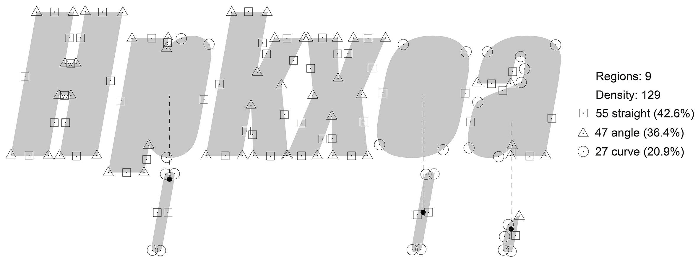

  
This notebook was written by Christian Mosbæk Johannessen, Dept. of Language and Communication, University of Southern Denmark.

It quantifies and operationalizes Theo van Leeuwen's @vanleeuwent.2005 so-called "distinctive feature"-approach to typography and incorporates elements of Andreas Stötzner's "Signography".

**Table of Contents**\
1. Setting up\
2. Deriving distinctive features from the two datasets\
3. Summary Statistics\
4. Principal Component Analysis\

# 1. Setting up\
**1.1 Load packages**\
This chunk loads the packages required to execute the notebook.

```{r}
packages <- c("ggplot2", "ggbiplot", "Hmisc", "factoextra", "FactoClass", "lattice", "plotly", "rgl", "car","here", "effsize", "psych")
lapply(packages, require, character.only = TRUE)
rm(packages)
```

**1.2. Load stroke data**\
In order to run this notebook, two different data frames need to be loaded. The first contains the measures we made of the overall proportions of the fonts as well as individual strokes. The other contains counts of shape occurences.

The first data frame consists of 30 different measures made on each of 147 fonts. Figure 1 illustrates where in each sample the measures were made:\


Notice in the data frame that one observation (row) corresponds with one of a given letter's strokes, 13 observations for each of the 147 fonts. The individual strokes are groped by ```Typeface``` (for example "Absolute Beauty") and identified by ```Stroke``` (H1, H2, H3 etc.). This dataframe contains the values that the case asks you to attempt to automatically reproduce.

```{r}
df <- read.csv("data/typography_data.csv", header = T, sep = ";")
df <- as.data.frame(df)
```

**1.3. Load shape data**\
The second dataset to be included is not one I expect you to deal with as part of this case. It contains counts of bounded shapes (shape envelopes) as well as occurrences of three types of shape features, Straights, Angles and Curves, as well as the sum of these occurrences (Density). Figure 2 is an illustration of the principle behind the annotation of shape features.\

<center>

{width=60%}
</center>

```{r}
shpdf <- read.csv(file = "data/typography_shape_data.csv", header = T, sep = ";")
shpdf <- as.data.frame(shpdf)
attach(shpdf)
shpdf <- shpdf[order(Typeface, na.last = F),]
```

# 2. Deriving distinctive features from the two datasets\
The next section of the script expands the dataframe ```df``` by deriving the variables Weight, Tension, Expansion, and Orientation from Van Leeuwen and Stötzner.

**2.1. Weight**\
Deriving the average weight of all the strokes in a given font is a bit roundabout. First, all direct measures of stroke widths (for example 70 px and 113 px for stroke o1 in the figure) are converted to WSR (Weight Scale Rating) by relating them to the font's X-height (384 px). This is done to establish a comparable reference of scale (lest image size and resolution becomes a factor in calculations). WSR  expresses stroke width as a float between 0 and 1 (with one being a stroke of equal width to X-Height). Because many strokes, for example o1, are of uneven width, we then average over the narrowest and widest part of the stroke to arrive at a mean WSR.

<center>

{width=50%}

</center>

```{r}
df$WSRnarrow <- df$narrow / df$Xheight
```
This calculates the Weight Scale Rating (WSR) of the narrowest measure of the stroke.
```{r}
df$WSRwide <- df$wide / df$Xheight
```
This calculates the Weight Scale Rating (WSR) of the widest measure of the stroke.
```{r}
df$Weight <- (df$WSRnarrow + df$WSRwide) / 2
```
This calculates the average WSR for the stroke.

**2.2 Tension**\
The tension ratio of a stroke expresses the so-called "entasis" or gestural dynamics (for example the result of a change in force during the production of the stroke in hand writing) of the individual stroke by relating the narrowest and widest measurement of the stroke. In the script this is based on the original pixel measurements.

<center>

{width=50%}

</center>

```{r}
df$Tension <- df$wide / df$narrow
```


**2.3. Expansion**\
The expansion of a font expresses how broadly the letters sit on the baseline. It is derived by relating the width of the letter "o" to the x-height (based on an assumption that the look and feel of a font tends to be fairly homogenous. If one letter is designed to be broad, all letters will be).

<center>

{width=50%}

</center>

```{r}
df$Expansion <- (df$Owidth / df$Xheight)
```


**2.4. Orientation**\
The orientation of a font expresses the tallness of letters, that is to say, how long are the ascenders and descenders in relation to the body of the letter (x-height). It is derived here by relating a measure of the Vertical Orientation (vertical distance between the top-most and bottom-most parts of the sample) to the x-height.

<center>

{width=50%}

</center>

```{r}
df$VertOrientation <- (df$Vorientation / df$Xheight)
```

**2.5. begin building summary data frame for PCA**\
Create new data frame called ```summary.typeface``` with grouped calculations of means of slope, weight, tension, expansion and orientation (from ```df```) using ```stats::aggregate()```. One of the variables, ```Slope```, based on a simple measurement of the angle between the stem of "k" and the base line (see fig. 7), reguires no further processing and is included as is.

<center>

{width=50%}

</center>

```{r}
summary.typeface <- aggregate(df[ , c("Index", "Slope" , "Weight" , "Tension" , "Expansion" , "VertOrientation")], by=list(df$Type , df$Typeface), FUN=mean)
summary.typeface <- as.data.frame (summary.typeface)
```

**2.6. Connectivity**\
The connectivity of a font expresses the extent to which letters are connected to one another. Script and Handwritten, which emulates italic writing, tend to have a high degree of connectedness. Sans Serif, which contains no information about hand writing gestures, tend not be connected at all.

<center>

{width=50%}
</center>

Expand ```summary.typeface``` with variable ```Connectivity``` which we're fetching from the ```shape_data.csv``` file (unelegant, but was an afterthought).

```{r}
summary.typeface$Connectivity <- shpdf$Connectivity / 5
features <- c("Type", "Typeface", "Index", "Slope", "Weight", "Tension", "Expansion", "VertOrientation", "Connectivity")
names(summary.typeface) <- features
rm(features) # A bit of housekeeping
```

**2.7. Contrast**\
Contrast expresses the difference in weight of the thinnest and thickest stroke in a letter.

<center>

{width=55%}
</center>

Because letters have a different number of strokes ("H" has three, "o" has one), automatically calculating ```Contrast``` between strokes is a bit more tricky than the previous features (which either took the stroke or the entire letter as their unit of analysis) and needs some further lines of code:

The next chunk simply calculates how many fonts are currently in the dataset (under the assumption that each font has 13 rows, one for each stroke):
```{r}
observations <- nrow(df)/13
```

Because the way we identified strokes in the dataset (conflating letters and strokes in a single identifier, e.g. H1, H2) makes subsetting difficult, the next chunk adds a variable, ```Letter```, and repeats a factor to build a new identifier (Turns out I could have done this more easily in OpenRefine).
```{r}
Letter <- c(rep("H", 3), rep("p", 2), rep("k", 3), rep("x", 2), rep("o", 1), rep("a", 2)) # A bit of data wrangling adding a variable, letter, because the way we formated 'stroke' in the dataset makes subsetting difficult
df$Letter <- rep(Letter, observations)
rm(Letter, observations) # Housekeeping
```

The next chunk adds a script to identify strokes with minimum and maximum weight for each letter and calculate a contrast ratio (min / max):
```{r}
contrast.ratio <- function(L){
  chosen <- subset(df, df$Letter==L)
  a <- sapply(split(chosen$Weight, chosen$Typeface), min)
  b <- sapply(split(chosen$Weight, chosen$Typeface), max)
  c <- b / a
  return(c)
}
```

The next chunk creates a new intermediate dataframe, ```df.contrast```, with columns for calculated differences for each letter (and adding the letter you want in place of 'L').
```{r}
df.contrast <- data.frame(contrast.ratio("H"), contrast.ratio("p"), contrast.ratio("k"), contrast.ratio("x"), contrast.ratio("o"), contrast.ratio("a"))
```

Column names in ```df.contrast``` are hobbile, so rename them with friendlier letters:
```{r}
column.headings <- c("H", "p", "k", "x", "o", "a")
names(df.contrast) <- column.headings
rm(column.headings, contrast.ratio)
```

Add a column, ```mean``` to ```df.contrast``` and fill with calculated means for each typeface:
```{r}
df.contrast$mean <- rowSums(df.contrast) / ncol(df.contrast)
```

Fetch ```mean``` for each typeface from ```df.contrast``` and add as column ```Contrast``` to ```summary.typeface```:
```{r}
summary.typeface$Contrast <- df.contrast$mean
rm(df.contrast) # housekeeping
```

**2.8. Shape**\
The next lines derive shape descriptors; (1) Density per region (```Dr```), (2) Straight as proportion of Density (```SD```), (3) Angle as proportion of Density (```AD```) and (4) Curve as proportion of Density (```CD```), and adds them to summary.

```{r}
summary.typeface$Dr <- (shpdf$Straight + shpdf$Angle + shpdf$Curve) / shpdf$Regions
```
This adds ```Dr``` to the summary.

```{r}
summary.typeface$SD <- shpdf$Straight / (shpdf$Straight + shpdf$Angle + shpdf$Curve)
```
This adds ```SD``` to the summary.

```{r}
summary.typeface$AD <- shpdf$Angle / (shpdf$Straight + shpdf$Angle + shpdf$Curve)
```
This adds ```AD``` to the summary.

```{r}
summary.typeface$CD <- shpdf$Curve / (shpdf$Straight + shpdf$Angle + shpdf$Curve)
```
This adds ```CD``` to the summary.

# 3. Summary Statistics\
Before moving on to Principal Compåonent Analysis, here are statistical summaries for each of the five typographical classes, Sans, Serif, Slab Serif, Handwritten and Script.

**3.1. Sans Serif Typefaces**\
```{r}
summary.sans <- subset(summary.typeface, summary.typeface$Type == "Sans")
summary(summary.sans)
```

**3.2. Serif (Humanist) Typefaces**\
```{r}
summary.serif <- subset(summary.typeface, summary.typeface$Type == "Serif")
summary(summary.serif)
```

**3.3. Slab Serif Typefaces**\
```{r}
summary.slab <- subset(summary.typeface, summary.typeface$Type == "Slab")
summary(summary.slab)
```

**3.4. Handwritten Typefaces**\
```{r}
summary.hand <- subset(summary.typeface, summary.typeface$Type == "Hand")
summary(summary.hand)
```

**3.5. Script Typefaces**\
```{r}
summary.script <- subset(summary.typeface, summary.typeface$Type == "Script")
summary(summary.script)
```

# 5. Principal Component Analysis
Using ```prcomp()``` with normalization (correlation matrix) by setting ```scale = TRUE``` (FALSE gives us a covariance matrix in stead):

```{r}
res.pca <- prcomp(summary.typeface[ , c(4:14)], scale = T)
```


The next chunk outputs a scree plot to examine how many PCs we need to consider and what is noise:
```{r}
get_eigenvalue(res.pca)
fviz_eig(res.pca) # Seems the first 3 are pretty relevant (74.7 % variance explained). Adding the 4th brings us to 88% variance explained.
```
Examine the results for Variables of the PCA
```{r}
res.var <- get_pca_var(res.pca)
res.var$coord          # Coordinates
res.var$contrib # Contributions to the PCs
correlation_matrix <- as.data.frame(res.var$coord) # Store the correlations as a matrix we can examine and use in the article
PCs <- c("PC1", "PC2", "PC3", "PC4", "PC5", "PC6", "PC7", "PC8", "PC9", "PC10", "PC11") # Rename the variables from Dim.1 to PC1, which is more transparent
colnames(correlation_matrix) <- PCs
rm(PCs) # Housekeeping
```

Make fancy biplot of PC1 vs. PC2
```{r}
type <- as.factor(summary.typeface$Type) # Subsets types for coloring the plot
fviz_pca_biplot(res.pca,
                axes = c(1, 2),
                col.ind = type,
                geom = c("point", "text"),
                label = "all", labelsize = 3, invisible = "none",
                repel = FALSE,
                habillage = "none", 
                palette = NULL,
                addEllipses = TRUE, title = "PCA - Biplot"
)
rm(type) # Housekeeping
```

```{r}
type <- as.factor(summary.typeface$Type) # Subsets types for coloring the plot
fviz_pca_biplot(res.pca,
                axes = c(1, 3),
                col.ind = type,
                geom = c("point", "text"),
                label = "all", labelsize = 3, invisible = "none",
                repel = FALSE,
                habillage = "none", 
                palette = NULL,
                addEllipses = TRUE, title = "PCA - Biplot"
)
rm(type) # Housekeeping
```

Make less fancy biplots, trying to rotate the data to reveal other structures (these are the two most interesting ones)
```{r}
ggbiplot(res.pca, choices = c(1,2), groups = summary.typeface$Type, ellipse = T, ellipse.prob = .95)
```

```{r}
ggbiplot(res.pca, choices = c(1,3), groups = summary.typeface$Type, ellipse = T, ellipse.prob = .95)
```